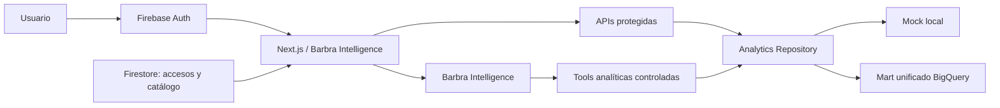

# Barbra Intelligence

Plataforma multi-organización de inteligencia de medios. Combina un dashboard ejecutivo con Barbra Intelligence, una experiencia contextual que consulta datos verificados y devuelve componentes visuales, no solamente texto.

## Qué está listo

- Jerarquía de acceso `organización → proyectos → campañas`.
- Google Sign-In con Firebase Authentication.
- Perfiles y permisos por proyecto en Firestore, validados también en el servidor.
- Dashboard responsive con KPIs, tendencia, mix de canales y comparativo de campañas.
- Barbra Intelligence contextual con respuestas gráficas mediante tool calling.
- Repositorio de datos intercambiable: `mock` para desarrollo y `bigquery` para producción.
- Consultas BigQuery parametrizadas, con vista permitida por configuración y límite de bytes procesados.
- Firebase CLI/MCP configurado a nivel del repositorio.

## Arquitectura



Firestore guarda identidad, membresías y el mapeo entre el catálogo de Barbra y los identificadores externos. BigQuery es la única fuente de verdad analítica. La aplicación y la IA nunca se conectan directamente con Google Ads, Meta Ads o TikTok Ads, ni reciben permiso para generar SQL libre.

Durante el demo sin Firestore, Firebase Authentication usa el claim firmado `barbra` como perfil (`role`, `organizationId`, `projectIds`). Cuando Firestore esté disponible, el servidor conserva compatibilidad con documentos `users/{uid}`.

## Desarrollo local

```bash
pnpm install
cp .env.example .env.local
pnpm dev
```

Sin configuración Firebase ni BigQuery, la aplicación inicia en modo demo. Para datos reales:

1. Completar las variables `NEXT_PUBLIC_FIREBASE_*` de la Web App de Firebase.
2. Crear los documentos de Firestore descritos abajo.
3. Autenticar Google Cloud con acceso de lectura al mart de BigQuery.
4. Establecer `ANALYTICS_PROVIDER=bigquery` y `BIGQUERY_ANALYTICS_VIEW`.
5. Activar `REQUIRE_FIREBASE_AUTH=true`.

## Contrato BigQuery

La vista configurada en `BIGQUERY_ANALYTICS_VIEW` debe exponer una fila diaria por cliente, fuente, cuenta y campaña:

| Campo | Tipo |
| --- | --- |
| `date` | `DATE` |
| `client_id`, `source`, `account_id`, `campaign_id` | `STRING` |
| `campaign_name`, `campaign_status`, `currency_code` | `STRING` |
| `spend`, `impressions`, `clicks`, `conversions`, `revenue` | `NUMERIC` o compatible |
| `last_synced_at` | `TIMESTAMP` |

`source` usa valores canónicos como `google_ads`, `meta_ads` y `tiktok_ads`. Conservar este contrato permite agregar fuentes al ELT sin modificar la UI ni Barbra Intelligence. Cada snapshot completo se construye con una única consulta con filtro de fechas y un límite estricto de bytes procesados.

## Modelo Firestore

```text
users/{uid}
  name, email
  role: "admin" | "user"
  organizationId: string | null // null for global admins
  projectIds: string[] // optional project-level restriction for users

organizations/{organizationId}
  name, slug
  analyticsClientId // corresponde a client_id en BigQuery

projects/{projectId}
  organizationId, name, clientName, status

campaigns/{campaignId}
  projectId, name, displayName?, objective, status
  source             // google_ads | meta_ads | tiktok_ads
  accountId          // account_id en BigQuery
  externalCampaignId // campaign_id en BigQuery
```

`name` conserva el nombre original de la plataforma. `displayName` es opcional y permite definir una etiqueta editorial para la UI; si no existe, la aplicación genera una versión legible sin modificar el identificador ni el nombre fuente.

Un proyecto puede agrupar campañas de múltiples canales. La aplicación traduce el ID interno de cada campaña a la tupla `source + accountId + externalCampaignId` antes de consultar BigQuery. Los documentos incompletos no aparecen en los selectores.

Las reglas en `firestore.rules` aplican el mismo alcance. Las APIs `/api/workspace`, `/api/dashboard` y `/api/chat` vuelven a validar el token y el proyecto en el servidor.

## Firebase MCP

El servidor oficial está configurado en `.codex/config.toml`. Para habilitarlo localmente:

```bash
npx firebase-tools@latest login --reauth
```

Después, abre de nuevo el repositorio en Codex para que cargue el MCP. La configuración limita las herramientas a Authentication y Firestore.

## Variables principales

Consulta `.env.example`. Las importantes son:

- `ANALYTICS_PROVIDER=mock|bigquery`
- `GCP_PROJECT_ID`
- `BIGQUERY_ANALYTICS_VIEW`
- `BIGQUERY_SERVICE_ACCOUNT_JSON` (cuenta dedicada, solo lectura, para Vercel)
- `BIGQUERY_MAX_BYTES_BILLED`
- `NEXT_PUBLIC_FIREBASE_*`
- `FIREBASE_SERVICE_ACCOUNT_JSON` (solo si el runtime no ofrece credenciales por defecto)
- `REQUIRE_FIREBASE_AUTH`
- `ANTHROPIC_API_KEY`

## Validación

```bash
pnpm typecheck
pnpm build:next
```
